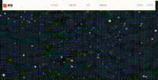
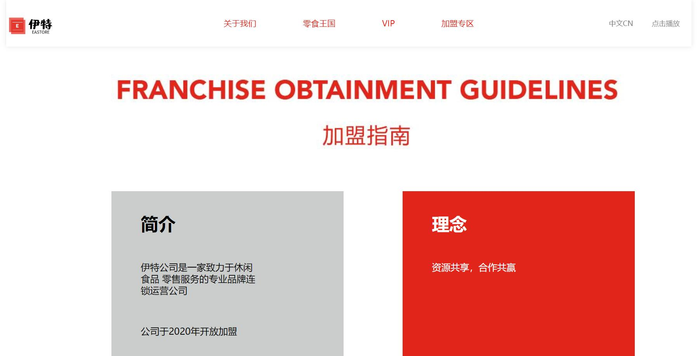

# Eater Website

- - -

Eater website is aimed at providing a world of food for gourmand. It helps people to buy what they want to eat straightly and order online with millions of snacks. If you are a food lover, welcome to Eater website!

## Site
- - -
- ### Main Page

 It is for user to brows and they can reach different pages depending on their needs.
 

- ### Abot us Page
 This page mainly introduce our brand and its history in order to help consumers to gain a better understanding of our website.
 

- ### Food Page
 This page contains the food we have and consumer can later log in to order online. 
 

- ### Log in Page
  
Browsers could only purchase after logging in. Otherwise, they need to register. And their information will be stored in database.
  

- ### Other Page
 The other pages like joining the VIP club or our company are also presented.

 

 

## Usage
- - -
### Development

Want to contribute? Great!

To fix a bug or enhance an existing module, follow these steps:
- Fork the repo
- Create a new branch (git checkout -b improve-feature)
- Make the appropriate changes in the files
- Add changes to reflect the changes made
- Commit your changes (git commit -am 'Improve feature')
- Push to the branch (git push origin improve-feature)
- Create a Pull Request

### Bug / Feature Request
- - -
If you find a bug (the website couldn't handle the query and / or gave undesired results), kindly open an issue here by including your search query and the expected result.

If you'd like to request a new function, feel free to do so by opening an issue [here][1]. Please include sample queries and their corresponding results.

### Built with
- - -
- [Navicat for MySQL][2] - Navicat for MySQL is the ideal solution for managing and developing MySQL or MariaDB.
- [Tomcat][3]-Powers numerous large-scale, mission-critical web applications.
- [Sublime text3][4]- Program in HTML, CSS and JavaScript with syntax higlghting engine.

[1]:https://github.com/Greco79/EaterWebsite/issues
[2]:http://www.navicat.com.cn/
[3]:https://tomcat.apache.org/
[4]:http://www.sublimetext.com/

### License
Greco79
